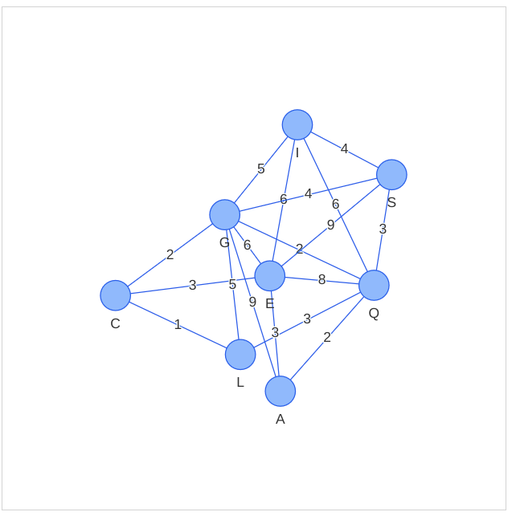

# pathfind-algorithms
Algoritmos de Busqueda de Rutas con Python

# Instalación
Crear un virtual enviroment con python 3 (virtualenv -p python3 ve_myenv), activarlo (source ve_myenv/bin/activate) e instalar la siguiente libreria para el manejo de graficos:

```
pip install pyvis
```

# Ejecución
Para ejecutar el simulador para busqueda de camino mas corto con algoritmo Dijkstra puede ejecutar el programa asi:

```
python dijkstra [SOURCE] [DESTINY]
```

Ejemplo:

```
python dijkstra.py Quito Cuenca
```


